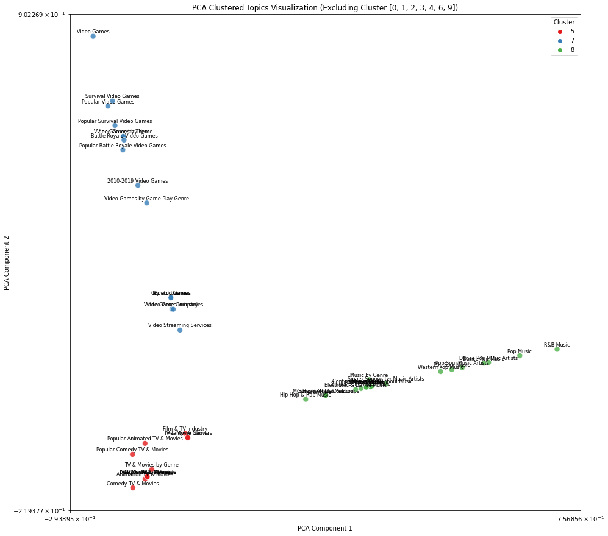

# instagram-yourtopics
 Clusters and visualises your topics determined by your activity on Instagram

 To run the `yourtopics.ipynb` first create a virtual python environment and install required packages using `pip install -r requirements.txt`

